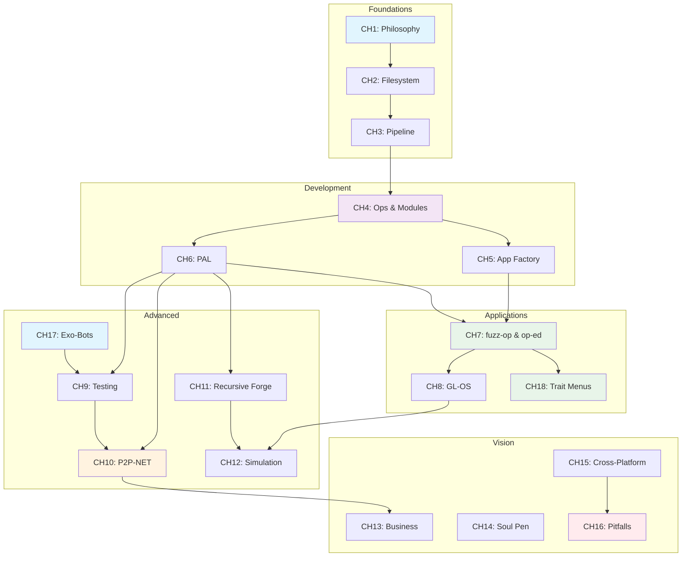

# 📚 TPMOS_TEXTBOOK 🎓
## The Definitive Guide to the Mono-OS (基于件的系统指南)

### Version 05.00 (Exo-Sovereignty Edition)

---

## Table of Contents

### Part I: Foundations
1. [The Soul of a Piece (Philosophy)](CH1_PHILOSOPHY.md)
2. [The Filesystem is the Database](CH2_FILE_SYSTEM.md)
3. [The 12-Step Pipeline](CH3_PIPELINE.md)

### Part II: Development
4. [Muscles & Brains (Ops & Modules)](CH4_DEVELOPMENT.md)
5. [The App Factory](CH5_SYSTEM_APPS.md)
6. [PAL: The Assembly Language of TPMOS](CH6_PAL.md)

### Part III: Flagship Applications
7. [fuzz-op & op-ed: The Flagship Apps](CH7_FUZZ_OP_OP_ED.md)
8. [GL-OS: Beyond ASCII (3D TPMOS)](CH8_GL_OS.md)

### Part IV: Advanced Systems
9. [The Guardians (Testing & Simulation)](CH9_TESTING.md)
10. [The Great Expansion (AI, LSR, & P2P)](CH10_FUTURE_HORIZONS.md)
11. [The Infinite Loop (Recursive Forge)](CH11_RECURSIVE_FORGE.md)
12. [The Simulation Theater](CH12_SIMULATION_THEATER.md)
13. [Exo-Sovereignty (External Operating Exo-Bots)](CH17_EXO_SOVEREIGNTY.md)
14. [Dynamic Trait Menus (PDL-Driven UI)](CH18_DYNAMIC_TRAIT_MENUS.md)

### Part V: Vision & Future
15. [Piecemark Labs & The Sovereign Venture](CH13_BUSINESS_STRATEGY.md)
16. [The Soul Pen & The Multiverse](CH14_SOUL_PEN.md)
17. [Cross-Platform TPMOS](CH15_CROSS_PLATFORM.md)
18. [Common Pitfalls & Debugging Guide](CH16_PITFALLS_DEBUGGING.md)

---

## Appendices
- [Known Bugs & Research Tasks](KNOWN_BUGS.md)
- [Glossary](GLOSSARY.md)
- [Quiz](QUIZ.md)
- [Answer Key](ANSWER_KEY.md)

---

## Dependency Graph

---

[Return to Main Index](../README.md)
